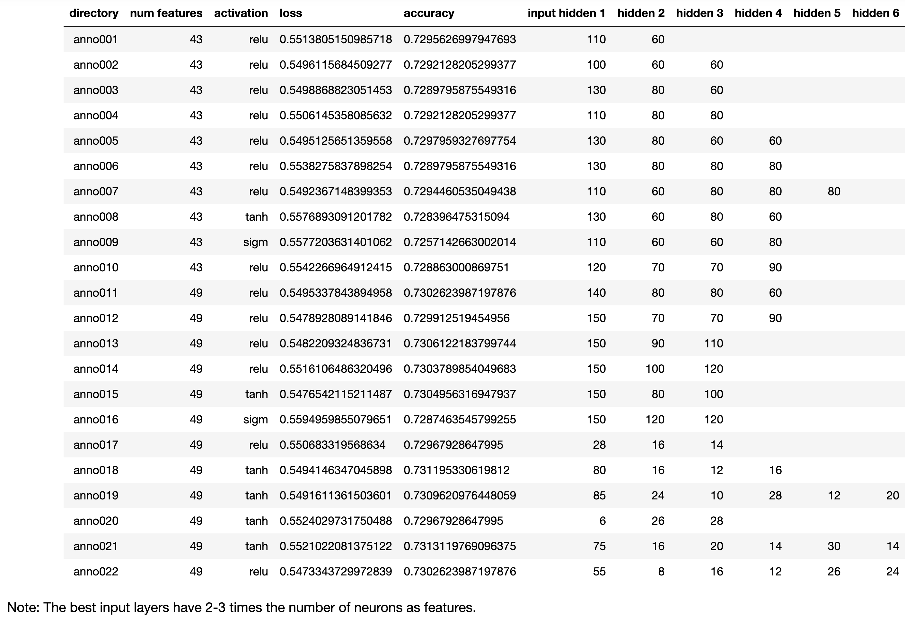

# Neural Network Charity Analysis
Module 19: Neural Networks and Deep Learning Models

## Overview

In some cases, datasets are complex enough that traditional learning models fall short. Deep learning, using neuron networks several layers deep, can provide an effective, higher performing alternative.

## Results

### Data Preprocessing

- **Variable as model target.** The `IS_SUCCESSFUL` variable is the only model target. A value of 1 or 0 indicates that the funding money was uses either successfully or unsuccessfully. 

- **Variables as model features.** 
    - The numerical feature variables are `STATUS` and `ASK_AMT`. They are suitable for modelling as is.           

    - The categorical feature variables are 
 `APPLICATION_TYPE`,
 `AFFILIATION`,
 `CLASSIFICATION`,
 `USE_CASE`,
 `ORGANIZATION`,
 `INCOME_AMT`, and
 `SPECIAL_CONSIDERATIONS`. Using `OneHotEncoder()`, they are fit and transformed to numerical values suitable for modelling. 

- **Variables that are neither targets nor features.** The `EIN` and `NAME` variables are not useful for modelling, as they are unique. They are removed.

- **Additional preprocessing.** 
    - Three different binnings were performed on the `CLASSIFICATION` feature, resulting in 6, 7, and 13 bins. The rationale was that there were several binning cutoffs apparent in the bin sizes.
    - One hot encoding was used on categorical features
    - Feature and target variables were split into training and testing sets, then scaled with `StandardScaler`. 

### Compiling, Training, and Evaluating the Model

When no automated neural network optimization was performed, the given parameters of 80 input neurons and 30 hidden layer1 neurons was used.

When automated neural network optimization was performed, parameters where chosen based on experienced opinion:
- the number of epochs was 20
- the activation functions relu, tanh, and sigmoid were used
- the input layer parameters ranged from 20 to 100 neurons 
- the hidden layers ranged from 1 to 5
- the hidden layer neurons ranged from 4 to 30
- the output layer had one neuron with a sigmoid activation function

After the best parameters were chosen from automated neural network optimization based on model accuracy, a final run of 100 epochs was performed. The results are shown in the table below.

| CL. bins | anno | act. | input | layer1 | layer2 | layer3 | layer4 | layer5 | loss | accuracy | 
| ---: | --- | --- | --- | --- | --- | --- | --- | --- | --- | --- |
| 6 | no | relu | 80 | 30 | | | | | 0.653 | 0.628 |
| 6 | yes | relu | 25 | 22 | 24 | 26 | | | 0.681 | 0.550 |
| 6 | yes | relu | 25 | 22 | 24 | 26 | 8 |  | 0.748 | 0.533 |
| 6 | yes | relu | 25 | 22 | 24 | 26 | 8 | 10 | 0.694 | 0.527 |
| 7 | no | relu | 80 | 30 | | | | | 0.700 | 0.697 |
| 13 | no | relu | 80 | 30 | | | | | 0.881 | 0.696 |
| 7 | yes | relu | 65 | 8 | 4 | 10 | 6 | 8 | 0.692 | 0.533 |

Table. CL. bins are the number of `CLASSIFICATION` bins used; anno is whether automated neural network optimization was used; act. is the activation function used for all hidden layers; input is the number of neurons in the input layer; layer[n] is the number of neurons in the nth hidden layer; loss and accuracy are the results from training the model for 100 epochs. The final output layer used one neuron with a sigmoid activation function.

## Summary

The best results were achieved by not using automated neural network optimization. The best result had an accuracy of 0.697, which corresponded to 7 `CLASSIFICATION` bins, and the relu activation function used with 80 neurons in the input layer and 30 neurons in the next hidden layer. This result falls short of the target accuracy of 0.750.

Moving from 6 `CLASSIFICATION` bins (0.628 accuracy) to 7 `CLASSIFICATION` bins (0.697 accuracy) was a good improvement, but a further increase to 13 `CLASSIFICATION` bins (0.696) had negligible effect.

It was anticipated that automated neural network optimization would outperform a good fixed guess, but that was not the case.

It should be noted that the automated neural network optimizer returns accuracies which range from 0.726 to 0.731 (see Appendix table) for best model parameters. However, when these best parameters were subsequently used to generate the results in the table above, the accuracies ranged from 0.527 to 0.550. This result indicates likely misuse of the automated neural network optimizer here.

Case studies towards the end of this module comparing other learning models with deep (neural) learning suggest that logistic regression, random forest, or SVN are viable alternatives. In many cases they are easier to interpret, simpler to implement, and cheaper to use.

## Appendix

Initially, to better understand the automated neural network optimizer, a variety of parameters using fixed layers, fixed activation functions, and various ranges of neurons per layer (data not shown) were used. All runs were 20 epochs. Accuracies of best model parameters ranged from 0.726 to 0.731.

